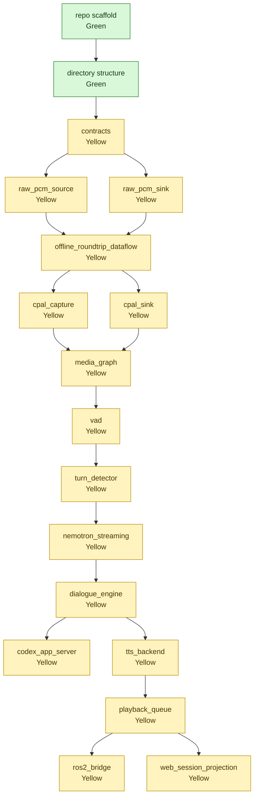

# Build Plan

This document tracks bottom-up construction status for `fluent-audio`.

## Status Rules

- Green = verified implementation or verified foundation task. Runtime code must exist and the representative verification command must pass before a runtime component can become green.
- Yellow = scaffold / partial. Directory and README only, or implementation exists but is not verified.
- Red = not implemented.

Current state: repository scaffold and agreed directory structure are green. Runtime implementation is not green yet.

## Progress Graph

## Progress Table

| Item | Path | Current status | Green condition | Representative verification |
| --- | --- | --- | --- | --- |
| `repo_scaffold` | repository root | Green: standalone public repository exists with Python package scaffold. | Public GitHub repo exists, package imports, and lint command passes. | `gh repo view Escenda/fluent-audio --json nameWithOwner,url,visibility`; `uv run --extra dev python -c "import fluent_audio; print(fluent_audio.__file__)"`; `uv run --extra dev python -m ruff check .` |
| `directory_structure` | `nodes`, `src/fluent_audio`, `dataflows`, `docs` | Green: agreed responsibility layout exists. | Nodes are grouped only where the hierarchy has meaning; no top-level `crates/`; no empty tracked `tests/`. | `find nodes -maxdepth 4 -type d \| sort` |
| `contracts` | `src/fluent_audio/contracts` | Yellow: package scaffold only. | Typed audio, timing, sequence, playback, VAD, ASR, and session contracts exist with boundary validation. | `uv run pytest tests/contracts` |
| `raw_pcm_source` | `nodes/io/sources/raw_pcm_source` | Yellow: node scaffold only. | Reads headerless PCM with explicit format, emits ordered `AudioChunk` payloads, and rejects size/frame mismatches. | `uv run pytest tests/nodes/io/test_raw_pcm_source.py` |
| `raw_pcm_sink` | `nodes/io/sinks/raw_pcm_sink` | Yellow: node scaffold only. | Accepts explicit-format `AudioChunk`, rejects format/sequence/frame mismatches, and writes exact PCM bytes. | `uv run pytest tests/nodes/io/test_raw_pcm_sink.py` |
| `offline_roundtrip_dataflow` | `dataflows` | Yellow: dataflow directory scaffold only. | Wires source to sink with explicit format and queue policy; fixture PCM roundtrips byte-for-byte. | `dora run dataflows/offline_roundtrip.yml --uv` and `cmp fixtures/offline/input.s16le artifacts/offline/output.s16le` |
| `cpal_capture` | `nodes/io/sources/cpal_capture` | Yellow: node scaffold only. | Opens an explicit CPAL input device, reports selected config, and emits correctly sized `AudioChunk` frames without implicit fallback. | `dora run dataflows/cpal_capture_smoke.yml --uv` |
| `cpal_sink` | `nodes/io/sinks/cpal_sink` | Yellow: node scaffold only. | Opens an explicit CPAL output device, consumes queue-owned audio, rejects format mismatch, and reports completion. | `dora run dataflows/cpal_sink_smoke.yml --uv` |
| `media_graph` | `nodes/media_graph` | Yellow: node scaffold only. | Owns the GStreamer graph internally, supports explicit passthrough/resample/branch setup, and tears down cleanly. | `dora run dataflows/media_graph_passthrough.yml --uv` |
| `vad` | `nodes/perception/vad` | Yellow: node scaffold only. | Consumes typed audio chunks and emits typed speech activity events on fixture audio. | `uv run pytest tests/nodes/perception/test_vad.py` |
| `turn_detector` | `nodes/perception/turn_detector` | Yellow: node scaffold only. | Consumes audio/activity context and emits typed turn boundary candidates with deterministic transition fixtures. | `uv run pytest tests/nodes/perception/test_turn_detector.py` |
| `nemotron_streaming` | `nodes/perception/nemotron_streaming` | Yellow: node scaffold only. | Streams audio to Nemotron 3.5 ASR Streaming 0.6B and emits typed transcript delta/final events. | `uv run pytest tests/nodes/perception/test_nemotron_streaming.py -m integration` |
| `dialogue_engine` | `nodes/interaction/dialogue_engine` | Yellow: node scaffold only. | Coordinates turn, transcript, interruption, agent event, TTS request, and playback state through typed events. | `uv run pytest tests/nodes/interaction/test_dialogue_engine.py` |
| `codex_app_server` | `nodes/agent/codex_app_server` | Yellow: node scaffold only. | Connects to Codex app-server, validates event stream payloads, and handles cancel/approval/tool events. | `uv run pytest tests/nodes/agent/test_codex_app_server.py -m integration` |
| `tts_backend` | `nodes/synthesis/tts_backend` | Yellow: node scaffold only. | Converts synthesis-ready text chunks into explicitly formatted audio chunks with backend smoke verification. | `uv run pytest tests/nodes/synthesis/test_tts_backend.py -m integration` |
| `playback_queue` | `nodes/interaction/playback_queue` | Yellow: node scaffold only. | Schedules synthesized chunks, handles cancel/barge-in, and correlates playback completion events. | `uv run pytest tests/nodes/interaction/test_playback_queue.py` |
| `ros2_bridge` | `nodes/bridges/ros2_bridge` | Yellow: node scaffold only. | Translates core status/events/commands and optional PCM tap at the ROS2 boundary with explicit payload validation. | `uv run pytest tests/nodes/bridges/test_ros2_bridge.py -m integration` |
| `web_session_projection` | `nodes/bridges/web_session_projection` | Yellow: node scaffold only. | Projects dialogue/session state for Web dashboard consumers with typed realtime payload fixtures. | `uv run pytest tests/nodes/bridges/test_web_session_projection.py` |
