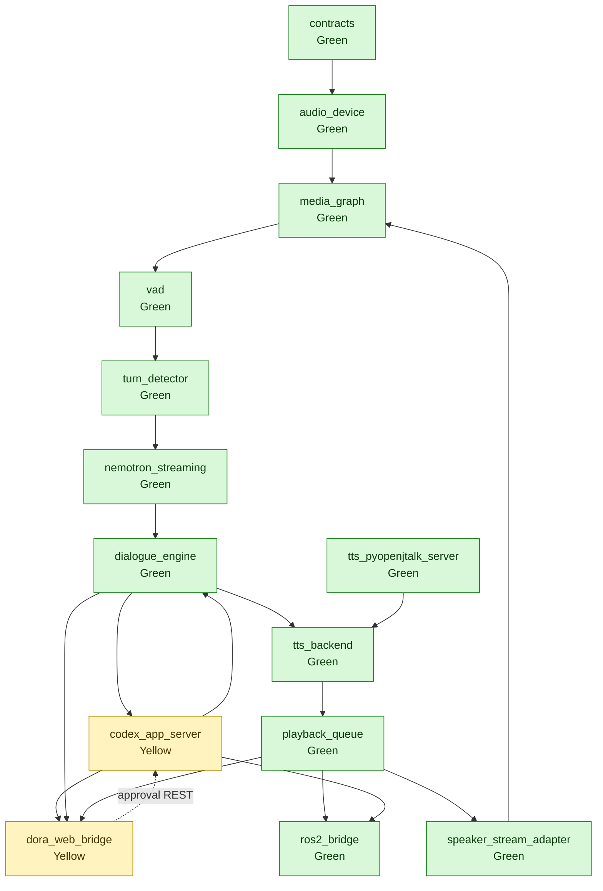

# Build Plan

This document tracks the bottom-up construction status for `fluent-audio`.

## Status Rules

- Green: implementation exists and a representative verification command has
  passed.
- Yellow: implementation exists but representative verification is incomplete.
- Red: not implemented.

## Current Direction

The primary runtime is DORA-based. ROS2 is an ecosystem bridge, not the audio/AI
pipeline runtime. The Web dashboard now observes DORA topics through
`dora_web_bridge`.

`dora_web_bridge` replaces the old dashboard projection/server/response-source
split:

- It exposes selected DORA topics through live REST/SSE endpoints.
- It keeps only bounded latest/recent transport buffers.
- It does not persist domain history.
- It does not decide whether an approval request is pending.
- Browser approval responses are HTTP control requests proxied to
  `codex_app_server` control REST.

## Progress Graph



`codex_app_server` and `dora_web_bridge` are yellow in this document until the
current REST-control approval refactor is re-verified after the code change.

## Key Runtime Components

| Component | Path | Responsibility | Representative verification |
| --- | --- | --- | --- |
| `audio_device` | `nodes/audio_device` | File, raw PCM, and CPAL audio boundaries. | `uv run --extra dev --extra dora python -m pytest tests/nodes/audio_device` |
| `media_graph` | `nodes/media_graph` | Internal GStreamer processing graph inside one DORA node. | `uv run --extra dev --extra dora python -m pytest tests/nodes/media_graph` |
| `vad` / `turn_detector` | `nodes/vad` | Voice activity and turn boundary events. | `uv run --extra dev --extra dora --extra vad python -m pytest tests/nodes/vad` |
| `nemotron_streaming` | `nodes/asr/nemotron_streaming` | Streaming ASR boundary. | `uv run --extra dev --extra dora python -m pytest tests/nodes/asr` |
| `dialogue_engine` | `nodes/dialogue_engine` | Voice-surface orchestration and TTS-ready text chunking. | `uv run --extra dev --extra dora python -m pytest tests/nodes/dialogue_engine` |
| `codex_app_server` | `nodes/dialogue_engine/codex_app_server` | Codex app-server JSON-RPC boundary and control REST approval queue. | `uv run --extra dev --extra dora python -m pytest tests/nodes/dialogue_engine/test_codex_app_server_node.py` |
| `dora_web_bridge` | `bridges/dora_web_bridge` | Live DORA topic REST/SSE bridge and approval REST proxy. | `uv run --extra dev --extra dora python -m pytest tests/bridges/test_dora_web_bridge_node.py` |
| `tts_backend` | `nodes/tts/tts_backend` | DORA text-to-HTTP TTS backend boundary. | `uv run --extra dev --extra dora --extra tts python -m pytest tests/nodes/tts` |
| `playback_queue` | `nodes/playback/playback_queue` | Synthesis playback scheduling and playback state/done events. | `uv run --extra dev --extra dora python -m pytest tests/nodes/playback` |
| `ros2_bridge` | `bridges/ros2_bridge` | ROS2 projection and ROS2-to-DORA command ingress. | `uv run --extra dev --extra dora python -m pytest tests/bridges/test_ros2_bridge_messages.py tests/bridges/test_ros2_bridge_ingress.py tests/bridges/test_ros2_bridge_sidecar.py tests/bridges/test_ros2_bridge_node.py tests/ros2` |

## Approval Flow

```text
agent_turn
  -> codex_app_server
  -> agent_approval topic
  -> dora_web_bridge live topic
  -> browser POST /api/agent-approvals/.../responses
  -> dora_web_bridge REST proxy
  -> codex_app_server control REST
  -> pending Codex JSON-RPC request
```

There is intentionally no Web approval response DORA output in the primary
approval route.

## Current Verification Targets

After changing the Web bridge / approval flow, run:

```bash
uv run --extra dev --extra dora python -m pytest \
  tests/bridges/test_dora_web_bridge_node.py \
  tests/nodes/dialogue_engine/test_codex_app_server_node.py

scripts/run_codex_app_server_web_approval_fixture_smoke.sh
uvx --from dora-rs-cli dora run graphs/codex_app_server_approval_fixture_smoke.yml --uv
uvx --from dora-rs-cli dora run graphs/codex_app_server_permissions_approval_fixture_smoke.yml --uv
```

The live hardware and live model paths remain guarded:

```bash
scripts/run_live_hardware_voice_session.sh --write-dataflow
scripts/run_codex_app_server_live_smoke.sh --write-live-approval-dataflow
FLUENT_AUDIO_ALLOW_LIVE_CODEX_TURN=1 scripts/run_codex_app_server_live_smoke.sh --live-approval
```
