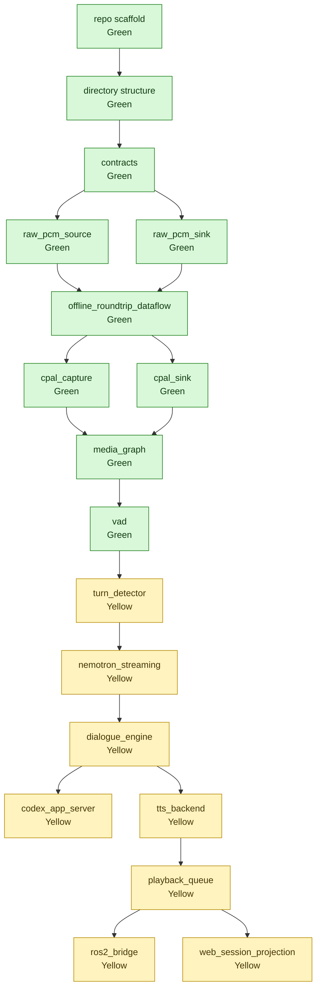

# Build Plan

This document tracks bottom-up construction status for `fluent-audio`.

## Status Rules

- Green = verified implementation or verified foundation task. Runtime code must exist and the representative verification command must pass before a runtime component can become green.
- Yellow = scaffold / partial. Directory and README only, or implementation exists but is not verified.
- Red = not implemented.

Current state: repository scaffold, agreed directory structure, contracts, raw PCM source/sink DORA boundaries, the offline DORA roundtrip dataflow, CPAL capture/sink hardware smokes, the GStreamer-backed `media_graph`, and the Silero VAD DORA node are green. Turn detection and later runtime nodes remain yellow.

## Progress Graph

## Progress Table

| Item | Path | Current status | Green condition | Representative verification |
| --- | --- | --- | --- | --- |
| `repo_scaffold` | repository root | Green: standalone public repository exists with Python package scaffold. | Public GitHub repo exists, package imports, and lint command passes. | `gh repo view Escenda/fluent-audio --json nameWithOwner,url,visibility`; `uv run --extra dev python -c "import fluent_audio; print(fluent_audio.__file__)"`; `uv run --extra dev python -m ruff check .` |
| `directory_structure` | `nodes`, `src/fluent_audio`, `dataflows`, `docs` | Green: agreed responsibility layout exists. | Nodes are grouped only where the hierarchy has meaning; no top-level `crates/`; no empty tracked `tests/`. | `find nodes -maxdepth 4 -type d \| sort` |
| `contracts` | `src/fluent_audio/contracts` | Green: Pydantic v2 contracts implemented for audio chunks, activity/turn events, ASR control, transcripts, dialogue/agent events, synthesis chunks, playback state, and session correlation. | Payload length, `seq`/sample continuity, capture time, format mismatch, serialized dump/validate roundtrip without computed helper fields, zero-frame audio span rejection, bounded probabilities/confidence, discriminated command/control variants, and correlation ids are verified. | `uv run --extra dev python -m pytest tests/contracts`; `uv run --extra dev python -m ruff check src/fluent_audio/contracts tests/contracts` |
| `raw_pcm_source` | `nodes/io/sources/raw_pcm_source` | Green: reads explicit headerless PCM, emits DORA `audio` uint8 Arrow payloads with typed flat metadata, and sends an explicit final marker. Task: [raw-pcm-io-implementation-task.md](raw-pcm-io-implementation-task.md). Prompt: [raw-pcm-io-subagent-prompt.md](raw-pcm-io-subagent-prompt.md). Review gate: [raw-pcm-io-review-gate.md](raw-pcm-io-review-gate.md). Current review: [raw-pcm-io-implementation-review.md](raw-pcm-io-implementation-review.md). | Reads headerless PCM with explicit format, emits ordered `AudioChunk` payloads, and rejects size/frame mismatches through the DORA node boundary. | `uv run --extra dev --extra dora python -m pytest tests/contracts tests/nodes/io`; `uv run --extra dev --extra dora python -m ruff check src/fluent_audio/offline src/fluent_audio/dora nodes/io tests/nodes/io`; `uv run --extra dora python -c "from dora import Node; print(Node)"` |
| `raw_pcm_sink` | `nodes/io/sinks/raw_pcm_sink` | Green: receives DORA `audio` uint8 Arrow payloads, reconstructs `AudioChunk` through typed metadata, rejects stream/format/sequence violations, and writes exact PCM bytes. Task: [raw-pcm-io-implementation-task.md](raw-pcm-io-implementation-task.md). Prompt: [raw-pcm-io-subagent-prompt.md](raw-pcm-io-subagent-prompt.md). Review gate: [raw-pcm-io-review-gate.md](raw-pcm-io-review-gate.md). Current review: [raw-pcm-io-implementation-review.md](raw-pcm-io-implementation-review.md). | Accepts explicit-format `AudioChunk`, rejects format/sequence/frame mismatches, and writes exact PCM bytes through the DORA node boundary. | `uv run --extra dev --extra dora python -m pytest tests/contracts tests/nodes/io`; `uv run --extra dev --extra dora python -m ruff check src/fluent_audio/offline src/fluent_audio/dora nodes/io tests/nodes/io`; `uv run --extra dora python -c "from dora import Node; print(Node)"` |
| `offline_roundtrip_dataflow` | `dataflows/offline_roundtrip.yml` | Green: live DORA smoke runs source to sink, and fixture PCM roundtrips byte-for-byte. Task: [raw-pcm-io-implementation-task.md](raw-pcm-io-implementation-task.md). Subagent prompt: [raw-pcm-io-subagent-prompt.md](raw-pcm-io-subagent-prompt.md). | Wires source to sink with explicit format and queue policy; fixture PCM roundtrips byte-for-byte through DORA. | `uvx --from dora-rs-cli dora run dataflows/offline_roundtrip.yml --uv`; `cmp tests/fixtures/offline/input.s16le artifacts/offline/output.s16le` |
| `cpal_capture` | `nodes/io/sources/cpal_capture` | Green: Rust CPAL input node opens explicit `alsa:hw:CARD=APE,DEV=0`, emits 25 typed DORA `audio` chunks, and sends an explicit final marker verified by `audio_probe`. | Opens an explicit CPAL input device, reports selected config, and emits correctly sized `AudioChunk` frames without implicit fallback. | `/home/aspa/.cargo/bin/cargo test --manifest-path nodes/io/shared/rust_audio_boundary/Cargo.toml`; `/home/aspa/.cargo/bin/cargo test --manifest-path nodes/io/sources/cpal_capture/Cargo.toml`; `uv run --extra dev --extra dora python -m pytest tests/contracts tests/nodes/io`; `uv run --extra dev --extra dora python -m ruff check .`; `uvx --from dora-rs-cli dora build dataflows/cpal_capture_smoke.yml --uv --local`; `uvx --from dora-rs-cli dora run dataflows/cpal_capture_smoke.yml --uv` -> `{"chunks":25,"frames":12000,"bytes":48000,"final_seen":true}` |
| `cpal_sink` | `nodes/io/sinks/cpal_sink` | Green: Rust CPAL output node opens explicit `alsa:hw:CARD=APE,DEV=0`, consumes silence from the DORA audio boundary, drains playback, and exits successfully. | Opens an explicit CPAL output device, consumes queue-owned audio, rejects format mismatch, and reports completion. | `/home/aspa/.cargo/bin/cargo test --manifest-path nodes/io/shared/rust_audio_boundary/Cargo.toml`; `/home/aspa/.cargo/bin/cargo test --manifest-path nodes/io/sinks/cpal_sink/Cargo.toml`; `uv run --extra dev --extra dora python -m pytest tests/contracts tests/nodes/io`; `uv run --extra dev --extra dora python -m ruff check .`; `uvx --from dora-rs-cli dora build dataflows/cpal_sink_smoke.yml --uv --local`; `uvx --from dora-rs-cli dora run dataflows/cpal_sink_smoke.yml --uv` |
| `media_graph` | `nodes/media_graph` | Green: DORA node owns an internal GStreamer `appsrc`/`appsink` graph, validates explicit input stream/format, emits typed main `audio` and optional `tap_audio`, preserves passthrough bytes, resamples 48k stereo to 16k stereo matching GStreamer reference output, sets appsrc/capsfilter caps explicitly, uses bounded tee queues, drains appsinks after GStreamer EOS before DORA final markers, and fails closed when no explicit final marker is processed. | Owns the GStreamer graph internally, supports explicit passthrough/resample/branch setup, and tears down cleanly. | `uv run --extra dev --extra dora python -m pytest tests/contracts tests/nodes/io tests/nodes/media_graph`; `uv run --extra dev --extra dora python -m ruff check .`; `uvx --from dora-rs-cli dora run dataflows/media_graph_passthrough.yml --uv`; `cmp tests/fixtures/offline/input.s16le artifacts/media_graph/passthrough_main.s16le`; `cmp tests/fixtures/offline/input.s16le artifacts/media_graph/passthrough_tap.s16le`; `uvx --from dora-rs-cli dora run dataflows/media_graph_resample.yml --uv`; `gst-launch-1.0 -q filesrc location=tests/fixtures/cpal/silence_48k_stereo_250ms.s16le ! audio/x-raw,format=S16LE,rate=48000,channels=2,layout=interleaved ! audioconvert ! audioresample ! audio/x-raw,format=S16LE,rate=16000,channels=2,layout=interleaved ! filesink location=/tmp/fluent_audio_gst_resampled_16k.s16le`; `cmp /tmp/fluent_audio_gst_resampled_16k.s16le artifacts/media_graph/resampled_16k.s16le` |
| `vad` | `nodes/perception/vad` | Green: DORA node consumes explicit 16 kHz mono `s16le` audio chunks, runs the pinned Silero ONNX model, emits typed voice activity events, flushes the final padded evaluation window, and closes on an explicit DORA audio final marker or DORA `INPUT_CLOSED` when previous chunks make the final sample index exact. | Consumes typed audio chunks, rejects stream/format/sequence violations and missing completion, emits typed speech activity events on fixture audio, and passes representative DORA smoke. | `uv run --extra dev --extra dora --extra vad python -m pytest tests/contracts tests/nodes/perception`; `uv run --extra dev --extra dora --extra vad python -m ruff check .`; `uvx --from dora-rs-cli dora run dataflows/vad_speech_smoke.yml --uv`; `grep -R "dict\[str, Any\]\|from typing import Any\|: object\|list\[object\]\|dict\[str, object\]" -n src nodes tests` |
| `turn_detector` | `nodes/perception/turn_detector` | Yellow: node scaffold only. | Consumes audio/activity context and emits typed turn boundary candidates with deterministic transition fixtures. | `uv run pytest tests/nodes/perception/test_turn_detector.py` |
| `nemotron_streaming` | `nodes/perception/nemotron_streaming` | Yellow: node scaffold only. | Streams audio to Nemotron 3.5 ASR Streaming 0.6B and emits typed transcript delta/final events. | `uv run pytest tests/nodes/perception/test_nemotron_streaming.py -m integration` |
| `dialogue_engine` | `nodes/interaction/dialogue_engine` | Yellow: node scaffold only. | Coordinates turn, transcript, interruption, agent event, TTS request, and playback state through typed events. | `uv run pytest tests/nodes/interaction/test_dialogue_engine.py` |
| `codex_app_server` | `nodes/agent/codex_app_server` | Yellow: node scaffold only. | Connects to Codex app-server, validates event stream payloads, and handles cancel/approval/tool events. | `uv run pytest tests/nodes/agent/test_codex_app_server.py -m integration` |
| `tts_backend` | `nodes/synthesis/tts_backend` | Yellow: node scaffold only. | Converts synthesis-ready text chunks into explicitly formatted audio chunks with backend smoke verification. | `uv run pytest tests/nodes/synthesis/test_tts_backend.py -m integration` |
| `playback_queue` | `nodes/interaction/playback_queue` | Yellow: node scaffold only. | Schedules synthesized chunks, handles cancel/barge-in, and correlates playback completion events. | `uv run pytest tests/nodes/interaction/test_playback_queue.py` |
| `ros2_bridge` | `nodes/bridges/ros2_bridge` | Yellow: node scaffold only. | Translates core status/events/commands and optional PCM tap at the ROS2 boundary with explicit payload validation. | `uv run pytest tests/nodes/bridges/test_ros2_bridge.py -m integration` |
| `web_session_projection` | `nodes/bridges/web_session_projection` | Yellow: node scaffold only. | Projects dialogue/session state for Web dashboard consumers with typed realtime payload fixtures. | `uv run pytest tests/nodes/bridges/test_web_session_projection.py` |
